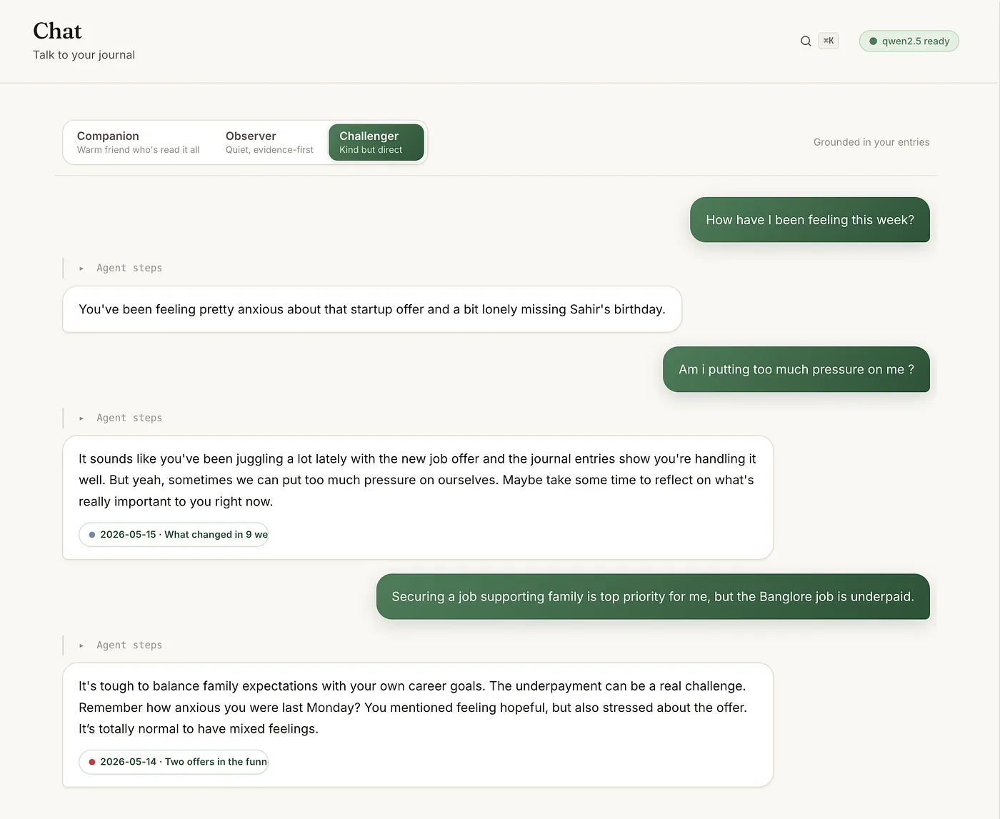
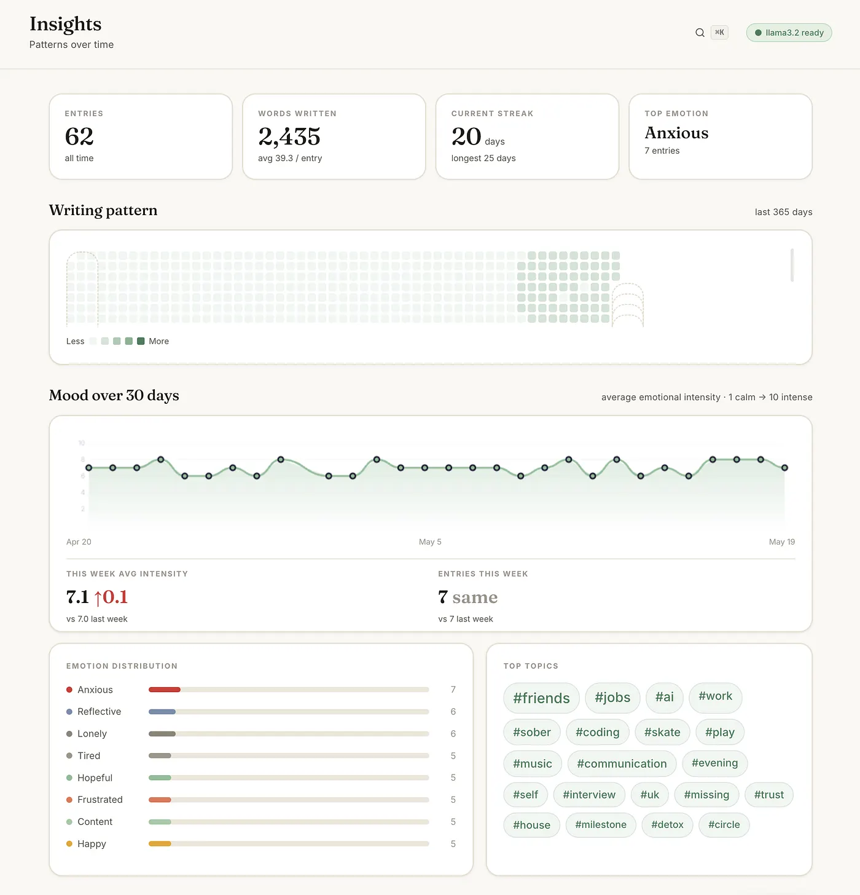
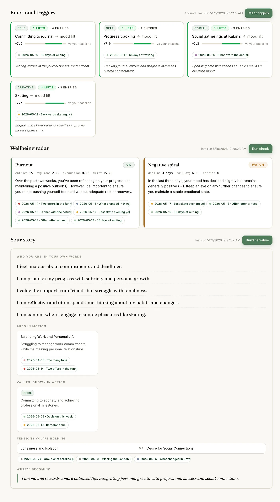
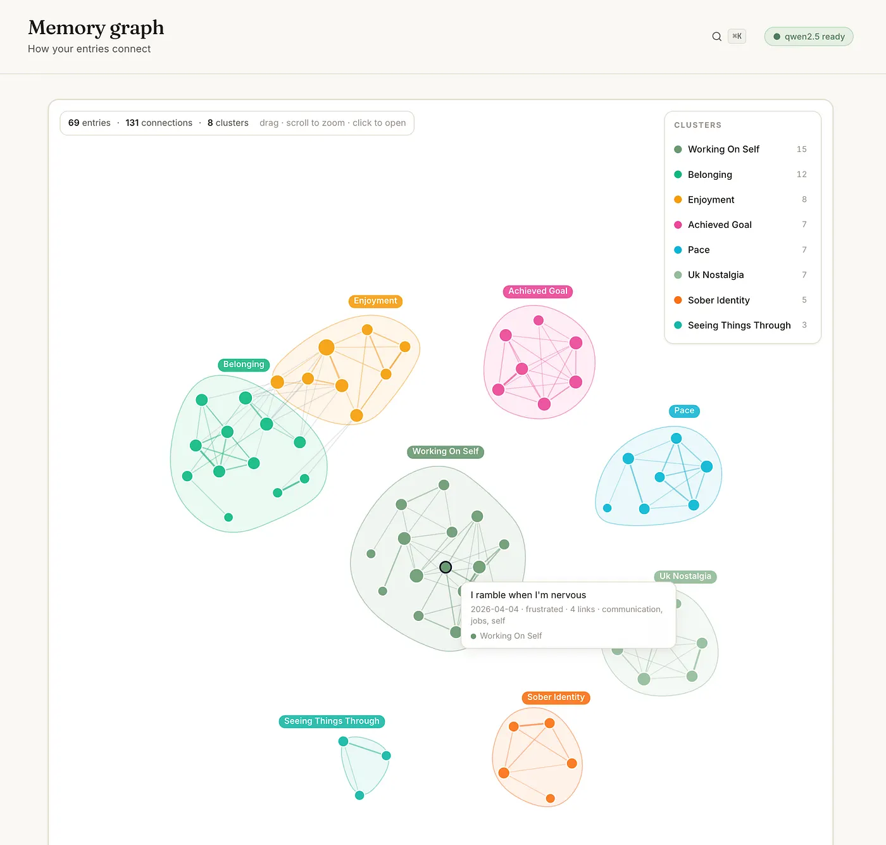
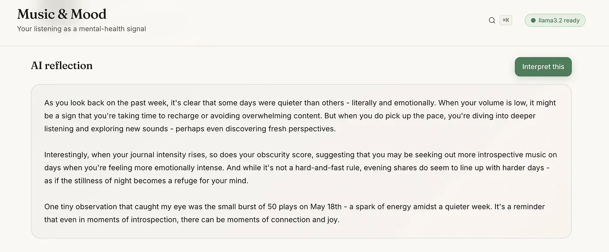
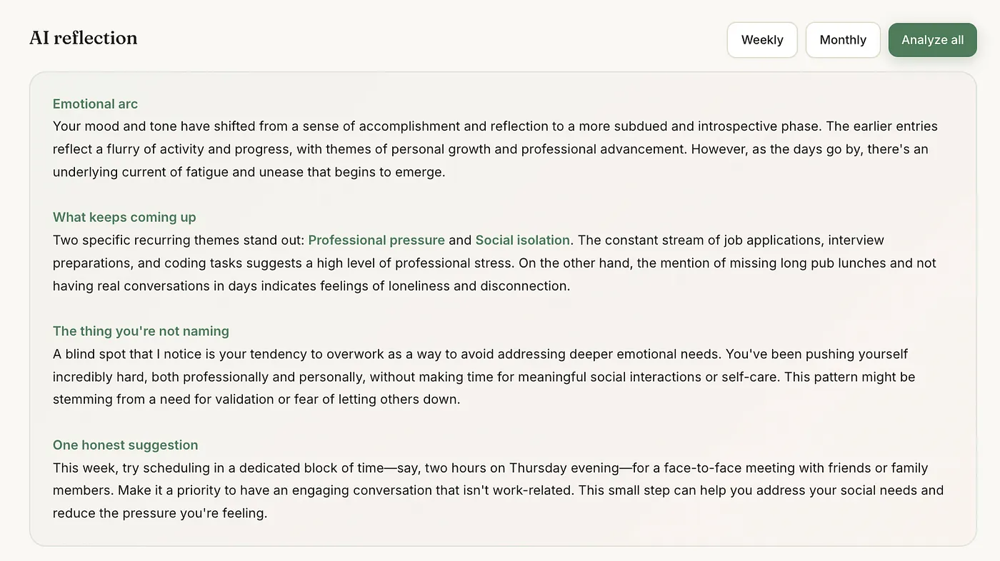

<div align="center">

# Innerbloom — Advanced AI Journal

### A journal that reads you back.

Write honestly. Innerbloom finds the emotion under your words, sees who's actually in your life, and watches you becoming — all on local AI, so nothing leaves your machine.

[](https://www.python.org/)
[](https://fastapi.tiangolo.com/)
[](https://ollama.ai/)
[](LICENSE)

</div>

---

## What It Does

You open a blank page and start typing. When you save, Innerbloom reads the entry once and tags it — the dominant **emotion** (one of 16), an **intensity** (1–10), a one-line **summary**, **tags**, deeper **themes**, and the **people** you mentioned. No friction, no forms. It just does it.

Then everything builds on those signals:

- **Chat** with your journal. A real agent loop plans, searches your entries, and answers in your terms — citing the exact entries it pulled from. Pick a voice: Companion, Observer, or Challenger.
- **People** cards show who actually appears in your writing — their dominant emotion around you, how often, and the last entries they show up in.
- **Insights** run four engines over your history: contradictions, emotional triggers, wellbeing trend, and narrative arc. They refresh in the background as you write.
- **Memory Graph** maps entries as nodes, links the ones that share meaning, and names each cluster automatically.
- **Music & Mood** correlates your Spotify listening with how you felt (optional, PKCE OAuth).
- **Month Ago Today** is a then-vs-now mirror — what stayed, what shifted, what you're still avoiding, what you're becoming, each claim cited.
- **Crisis detection** quietly surfaces help resources if your writing signals self-harm or suicidal ideation.













Everything stays on your machine. No cloud, no account, no telemetry. The only outbound traffic is to local Ollama, and to Spotify *if* you connect it.

---

## How It Works

### Entry analysis
Every saved entry is classified by the LLM in a single pass into a strict JSON shape: `emotion`, `intensity`, `summary`, `tags`, `themes`, and `people`. Emotion is constrained to a fixed vocabulary of 16 (`happy, sad, anxious, calm, grateful, frustrated, excited, reflective, hopeful, tired, angry, content, lonely, proud, overwhelmed, neutral`) so downstream stats stay consistent.

### Semantic memory (grounded, not hallucinated)
- Entries are embedded with `mxbai-embed-large` (1024-dim vectors).
- Long entries are **semantically chunked** — split into paragraph-sized pieces, each embedded separately. Retrieval max-pools over a parent's chunks so a long entry doesn't dilute itself.
- Search is **hybrid**: keyword matching plus cosine similarity over embeddings.
- Embeddings are **stamped with the model name** and lazily backfilled — switch embedding models and Innerbloom re-embeds on next access.

### Agent loop with streaming steps
The chat (`/chat/agent`) is a real agent, streamed as JSONL:
1. **Classify** — is this small talk, a follow-up, or a real question?
2. **Plan** — the LLM decides which tools to call (or asks you a clarifying question).
3. **Tools** — `search_entries`, `get_entry`, `list_themes`, `period_summary`, `emotion_extremes`.
4. **Draft** — the LLM synthesizes findings and streams tokens back.

You watch each step appear live. Citations use `[cite:id]` and link straight to the source entry.

### Personality modes
Three voices, each a different system prompt:
- **Companion** — warm friend who's read it all.
- **Observer** — quiet, evidence-first; notices patterns without moralizing.
- **Challenger** — kind but direct; names the gap between what you say and what you do.

### Insight engines
Four engines, each cached to `data/insights.json` and refreshable on demand or automatically in the background as new entries land:
- **Contradictions** — stated values vs. actual behavior, every claim backed by entry IDs.
- **Triggers** — statistical correlation of tags with mood shifts, characterized in plain language.
- **Wellbeing** — 14-day rolling burnout trend + 7-day emotional trajectory (levels are stats-driven; the LLM only writes the summary).
- **Narrative** — identity, recurring values, tensions, and character arc.

A background pipeline runs the engines in threads; `/insights/status` drives a progress indicator in the UI.

### Memory graph
`/graph` builds nodes (entries) and edges scored by an **IDF-weighted Jaccard** over shared tags/themes/emotion — so common-everywhere tags don't dominate. It runs connected components, splits any mega-cluster by its most discriminating sub-feature, and names each cluster after a term that *distinguishes* it (LLM-named, cached in `data/cluster_names.json`).

### People graph
`/people` aggregates everyone you named: mention count, first/last seen, dominant emotion around them, average intensity, co-occurring themes/tags, and recent entries to click into.

### Crisis detection
Two-stage and non-blocking. A fast regex pass catches explicit signals; ambiguous cases go to a tight LLM classifier. The reply is never withheld — a `safety` block with helplines (iCall, AASRA, 988, Samaritans, Find a Helpline) is attached alongside it.

---

## Quickstart

### Prerequisites
- **Python 3.10+**
- **Ollama** running: https://ollama.ai
- A chat model — default `qwen2.5:7b` (~4.7 GB)
- An embedding model — default `mxbai-embed-large` (or `nomic-embed-text`)

### 1. Install

```bash
git clone https://github.com/GhanshyamPaunikar/journal-ai.git
cd journal-ai
pip install -r requirements.txt
```

### 2. Start Ollama and pull models

```bash
ollama serve
# in another terminal:
ollama pull qwen2.5:7b
ollama pull mxbai-embed-large
```

### 3. Run the backend

```bash
uvicorn app:app --host 0.0.0.0 --port 5000
```

All data lives in `./data/`.

### 4. Serve the frontend

```bash
python -m http.server 8000
# open http://localhost:8000/index.html
```

### (Optional) Seed sample data

To explore with a populated journal, generate a 65-day fake one:

```bash
python seed_journal.py
```

---

## Usage

### Writing
1. Go to **Write**
2. Type or dictate (mic button uses the Web Speech API)
3. `Cmd/Ctrl-S` to save — analysis runs instantly, tags and emotion appear

### Chatting
1. Go to **Chat**
2. Pick a **voice** (Companion / Observer / Challenger) — switchable per message
3. Ask a question and watch the agent plan → search → answer
4. Click `[cite:…]` pills to open the source entry

### Insights
Go to **Insights** for four cards — Contradictions, Triggers, Wellbeing, Narrative. They refresh in the background as you add entries; each card links to cited entries.

### Memory graph
Go to **Graph**. Drag nodes, hover for details, scroll to zoom, click a node to open the entry. Clusters are named automatically.

### People
Go to **People** to see who shows up in your writing and the emotional shape of each relationship.

### Music & Mood
Connect Spotify in **Settings**, then open **Music** for recent plays, top artists, listening patterns, genre-mood mapping, and music-vs-mood correlation.

### Search & export
Search is keyword + semantic. **Export** dumps your whole journal to Markdown.

---

## Environment Variables

```bash
INNERBLOOM_MODEL=qwen2.5:7b                                      # chat model
INNERBLOOM_EMBED_MODEL=mxbai-embed-large                         # embedding model
INNERBLOOM_OLLAMA_URL=http://localhost:11434/api/generate        # generation
INNERBLOOM_OLLAMA_EMBED_URL=http://localhost:11434/api/embeddings# embeddings
INNERBLOOM_OLLAMA_TAGS_URL=http://localhost:11434/api/tags       # model list / health
INNERBLOOM_DATA_DIR=./data                                       # storage
```

### Picking a model

The default is **`qwen2.5:7b`** — the best quality that fits inside 8 GB of RAM. Swapping the model only changes *quality*; every endpoint and engine works at any size.

| Model                           | RAM            | Speed (M1)   | What gets better                                                                  |
| ------------------------------- | -------------- | ------------ | -------------------------------------------------------------------------------- |
| `llama3.2:3b`                   | 8 GB           | ~30 tok/s    | Fast, but bot-y and invents intentions. Demo-grade.                              |
| `qwen2.5:7b` *(default)*        | 8 GB tight     | ~15 tok/s    | The right floor. Chat feels human, contradictions ground in real text.          |
| `mistral:7b-instruct`           | 8 GB tight     | ~18 tok/s    | Drier voice, strong at *triggers* (stats-style reasoning).                       |
| `llama3.1:8b`                   | 16 GB ideal    | ~10 tok/s    | Sharper long-context narrative. Background-only on 8 GB.                         |
| `qwen2.5:14b`                   | 16+ GB         | ~4 tok/s     | Therapist-grade nuance. Chat is slow.                                            |
| `gpt-oss:20b` / `mixtral:8x7b`  | 24+ / 48+ GB   | 2–6 tok/s    | *Narrative* and *wellbeing summary* become genuinely worth re-reading.           |

```bash
ollama pull llama3.1:8b
INNERBLOOM_MODEL=llama3.1:8b uvicorn app:app --port 5000
```

**The embedding model matters most.** Pulling `mxbai-embed-large` (or `nomic-embed-text`) is the single biggest upgrade — without it, retrieval falls back to keyword matching; with it, "when did I feel unappreciated?" finds entries about *being overlooked* even if neither word appears.

---

## API Reference

### Entries
| Method | Path | Purpose |
|---|---|---|
| `POST` | `/save` | Create & analyze entry |
| `GET` | `/journal` | List entries (filters: `q`, `tag`, `emotion`) |
| `GET` | `/journal/{id}` | Retrieve one |
| `PUT` | `/journal/{id}` | Edit |
| `DELETE` | `/journal/{id}` | Delete |
| `GET` | `/search?q=` | Keyword + semantic search |
| `GET` | `/export` | Markdown export |

### Chat & agent
| Method | Path | Purpose |
|---|---|---|
| `POST` | `/chat/agent` | Agent loop, JSONL streaming (classify→plan→tools→draft) |
| `POST` | `/chat` | One-shot chat with citations |
| `POST` | `/chat/stream` | Token-streamed reply |
| `GET` | `/chat` | History |
| `DELETE` | `/chat` | Clear history |

### Insights & analysis
| Method | Path | Purpose |
|---|---|---|
| `GET` | `/insights/contradictions` · `/triggers` · `/wellbeing` · `/narrative` | Read cached insight |
| `POST` | `/insights/{engine}/refresh` | Recompute one engine (background) |
| `POST` | `/insights/refresh-all` | Recompute all |
| `GET` | `/insights/status` | Background pipeline progress |
| `GET` | `/analyze` | Long-term synthesis |
| `GET` | `/stats` | Streaks, word counts, mood distribution, heatmap |
| `GET` | `/graph` | Memory graph nodes, edges, named clusters |
| `GET` | `/people` | Per-person relationship stats |
| `GET` | `/anniversary?days=30` | Then-vs-now reflection |
| `GET` | `/weekly-review` · `/monthly-review` | Period reflections |
| `GET` | `/connections/{id}` | Related past entries |
| `GET` | `/reflect/{id}` | Reflection questions for an entry |
| `POST` | `/reflect/{id}/answers` | Save reflection answers |
| `GET` | `/prompt` | Adaptive writing prompt |

### Spotify (optional)
| Method | Path | Purpose |
|---|---|---|
| `GET` | `/spotify/status` | Connection state |
| `POST` | `/spotify/config` · `/exchange` · `/disconnect` | PKCE setup / teardown |
| `GET` | `/spotify/recent` · `/top` · `/listening-pattern` | Plays, top artists, patterns |
| `GET` | `/spotify/genre-mood` · `/daily` · `/mood` · `/insight` | Music-mood correlation |

### Health
| Method | Path | Purpose |
|---|---|---|
| `GET` | `/` | App status |
| `GET` | `/health` | Ollama connection status |

---

## Testing

```bash
python test_app.py
```

Runs end-to-end against FastAPI's `TestClient` with Ollama and Spotify mocked. Expected: **69 checks passing** across entry CRUD, chat, the agent loop, insight engines, search, crisis detection, stats, and Spotify.

---

## Architecture

```
┌─────────────────────────┐         ┌──────────────────────┐
│   index.html (SPA)      │◄───────►│   app.py (FastAPI)   │
│   Write / Entries       │  HTTP   │   Routes + RAG       │
│   Chat / Insights       │         │   Hybrid search      │
│   Graph / People        │         │   Insight engines    │
│   Music / Settings      │         │   Agent loop         │
└─────────────────────────┘         └──────────┬───────────┘
          │                                     │
          │                                     ▼
          │                         ┌──────────────────────┐
          │                         │  Ollama (localhost)  │
          │                         │  qwen2.5:7b          │
          │                         │  mxbai-embed-large   │
          │                         └──────────────────────┘
          │ (optional, PKCE OAuth)
          ▼
    ┌──────────────┐
    │   Spotify    │
    └──────────────┘
```

**Key design decisions:**
- **Single-file frontend** — no build step, no dependencies, no `node_modules`.
- **JSON on disk** — every artifact (journal, chat, insights, cluster names, Spotify tokens) is a local file in `./data/`.
- **Lazy, versioned embeddings** — computed on first use, cached, re-run when the model changes.
- **JSONL streaming** — agent steps and tokens arrive in real time.
- **Background insight pipeline** — engines run in threads; the UI polls `/insights/status`.

---

## Privacy & Security

- **100% private by default** — no cloud, no account, no telemetry.
- Entries live in `./data/` on your machine only.
- **Outbound traffic:** `localhost:11434` (Ollama) and Spotify (only if you connect it, via PKCE — no client secret).
- **Erase everything:** `rm -rf data/`

---

## Keyboard Shortcuts

| Key | Action |
|---|---|
| `Cmd/Ctrl-K` | Command palette (jump to any view) |
| `Cmd/Ctrl-S` | Save entry (in Write) |
| `Esc` | Close modals / palette |

---

## Spotify Setup (Optional)

1. Go to [developer.spotify.com/dashboard](https://developer.spotify.com/dashboard)
2. Create an app and copy the **Client ID**
3. In Innerbloom's **Settings**, paste the Client ID and note the redirect URI shown
4. Add that redirect URI to your Spotify app (must match exactly)
5. Click **Connect Spotify** and complete the OAuth flow

Innerbloom uses PKCE (no client secrets); your token is stored locally and auto-refreshes.

---

## Deploying the Frontend (Optional)

The SPA is static and can be hosted anywhere (a `vercel.json` is included for Vercel). The backend needs local Ollama, so deploy the frontend and point it at your machine, or run the whole thing locally.

---

## License

**MIT** — build, modify, and use Innerbloom however you want.

---

<div align="center">

*The best person to understand your mind is you — with a little help from local AI.*

</div>
