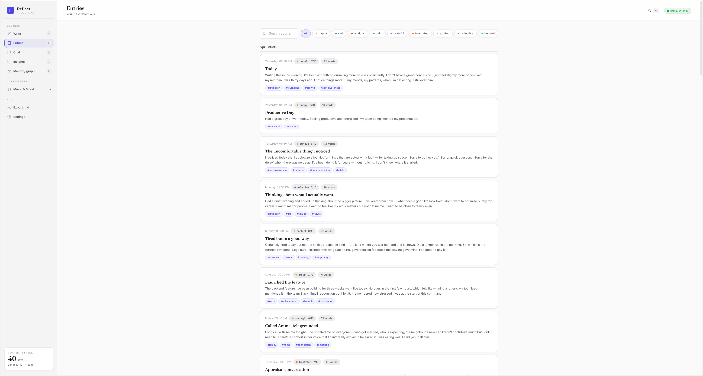
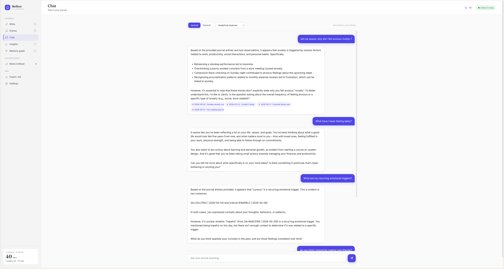
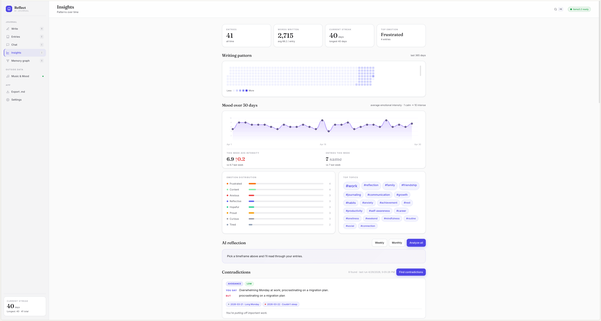
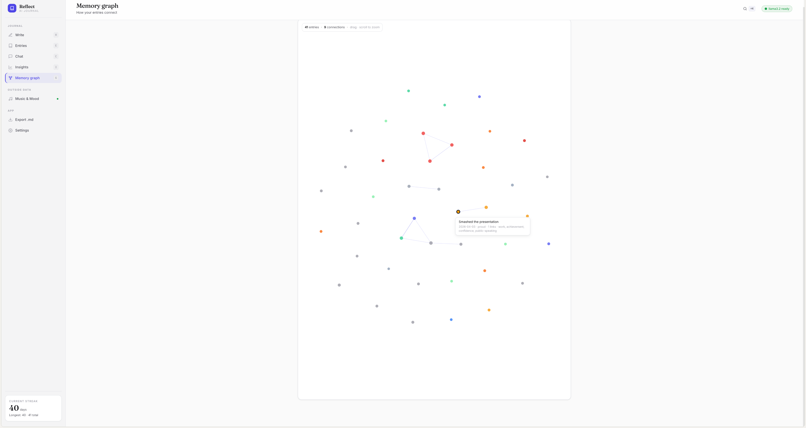

<div align="center">

# Innerbloom — Advanced AI Journal

### A journal that reads you back.

Write honestly. Innerbloom listens—finds your patterns, sees who's actually in your life, watches you becoming. Uses local AI so nothing leaves your machine.

[](https://www.python.org/)
[](https://fastapi.tiangelo.com/)
[](https://ollama.ai/)
[](LICENSE)

</div>

---

## What You'll Discover

You open the app on a Tuesday night. There's a blank page. You start typing.

As you write, Innerbloom is listening. By the time you hit save—almost before you think about it—the system has found the emotion underneath your words. Anxious. Hopeful. Frustrated. Tired. It's tagged the real themes woven through what you wrote. No friction. You never asked it to do this. It just did.



A few days pass. A week of entries, maybe a dozen. One night you ask the app something real: *What actually triggers my anxiety?* You pick a personality—the calm therapist, or the honest coach who doesn't sugarcoat. You watch the AI work in real-time. It searches everything you've written, finds the threads that connect, and answers you. Not in generic terms. In *your* terms, with the exact moments it pulled the answer from. Click a citation and you're back in that entry, reading the proof.



You notice something else: when you write about certain people, the same feelings come up. Your mom always appears in entries about boundaries. Your best friend shows up on the good nights. There's someone who shows up in your writing when you're frustrated, and someone else when you're calm. You click over to People—and there it is. Each person gets their own card. You see how you actually write about them. Not who you think about, but who appears in your real thoughts. The dominant emotion around them. How it's shifted over time. The last few moments they appeared. You suddenly see something sharp and true: *who's actually present in your life?* Not who you wish was there. Not who you're performing for. Who shows up when you're being honest on the page.


After a month of writing, you scroll through Insights. Four cards are waiting.

The first shows contradictions. Times you said one thing but did another—a pattern backed by evidence from your own entries. You read it and it stings a little, but it's true.

The second is emotional triggers. What actually makes you move—what consistently shifts your mood. The system pulled this from statistics (which tags correlate with your ups and downs), but the AI reads it in human language. Here's what moves you.

The third is about your wellbeing. Is there a burnout trend forming? Are you spiraling emotionally? The card doesn't judge—it just shows you the shape of your mood over the last two weeks and sounds an early warning if something's tipping.

The fourth is about your narrative. Who are you becoming? What values keep reappearing in your writing? What tensions are you holding? It reads like a friend who's been listening closely for a month has written a paragraph about your year.



You click to the graph. Your entries are mapped as a living landscape—entries as nodes, pulled together when they share meaning. The system named the clusters automatically. Not by tags you gave it, but by what actually distinguishes each grouping. *Returning Adjustments. One-Sided Friendships. Job Offer Preparation. Sober Nights.* You can click a cluster and watch how your emotions shifted through that whole thread. Drag it around. Hover to see entry details. It's your mind, rendered as a map.



Then one day you notice something you almost missed. It's been 30 days since that first entry. The system surfaces a *Month Ago Today* card—a then-vs-now mirror.

What's stayed the same? Your baseline values. The thing you keep bumping into.

What's shifted? Real changes. The system cites specific entries so you can read the before and after yourself.

What are you still avoiding? The pattern you haven't touched yet.

What are you becoming? Not destination—direction. The shape your life is actually taking.

Every claim cites an entry. You can click and read the proof. It's not someone telling you who you are. It's you, reading evidence of who you're becoming.

You also notice: Spotify is connected. You can see your recent plays, your most-played artists, your listening patterns by time of day and day of week. You can see which artists kept you company on your hard days. The system can tell you something about the correlations between your music and your mood—which artists you lean on when you're anxious, which ones show up on your good nights.

Throughout all of this, there's a quiet gentleness. You get a journaling question in the morning if you want one. An evening nudge if you skip a day. A streak alert if you're in the zone and about to break your run. These notifications fire in-browser, and if you install Innerbloom as an app on your phone, they'll reach you anywhere.

And one more thing: if you ever write something the system detects as crisis—self-harm language, suicidal ideation—it steps in quietly. Not a lecture. Just immediate access to resources. 988. Crisis text lines. Real help, presented simply.

Everything stays on your machine. No cloud. No analytics. No one is reading your entries but you and the AI that's learning to help you read yourself.

This is what it feels like when a journal understands you back.

---

## How It Works

### Semantic Memory (No Hallucinations)
- Entries are embedded using `mxbai-embed-large` (1024-dim vectors) for semantic understanding
- When you ask a question, the system searches both keywords AND semantic meaning
- All claims cite specific entries with timestamps — no made-up references

### Agent Loop with Streaming Steps
The chat uses a real agent architecture:
1. **Planner** — LLM reads your question and decides which tools to use
2. **Tools** — Search journal, retrieve specific entries, list themes/patterns
3. **Drafter** — LLM synthesizes findings into a coherent answer
4. **Streaming** — You see each step in real-time, then tokens streaming in as the answer forms

### Personality Modes
Switch your AI's voice:
- **Honest Coach**: Direct, practical, calls out patterns
- **Calm Therapist**: Warm, validating, exploratory
- **Analytical Observer**: Data-focused, pattern-heavy, detached

Each mode uses a different system prompt and has its own reasoning style.

### Insight Engines
- **Contradictions**: LLM identifies stated values vs. actual behavior, requires evidence IDs
- **Triggers**: Statistical analysis + LLM characterization of emotional patterns
- **Wellbeing**: 14-day rolling burnout trend + 7-day emotional trajectory
- **Narrative**: Identity extraction, values, tensions, and character arc analysis

All insights are stored in `data/insights.json` for review history.

---

## Quickstart

### Prerequisites
- **Python 3.10+**
- **Ollama** installed and running: https://ollama.ai
- A chat model (default is `qwen2.5:7b` — ~4.7 GB)
- An embedding model (default is `mxbai-embed-large`; alternatively `nomic-embed-text`)

### 1. Clone & Install

```bash
git clone https://github.com/yourusername/innerbloom.git
cd innerbloom

pip install -r requirements.txt
```

### 2. Start Ollama (if not already running)

```bash
ollama serve
# In another terminal:
ollama pull qwen2.5:7b
ollama pull mxbai-embed-large  # semantic search (or use nomic-embed-text)
```

### 3. Run the Backend

```bash
uvicorn app:app --host 0.0.0.0 --port 5000
```

The server will start on `http://localhost:5000`. All your journal data lives in `./data/`.

### 4. Serve the Frontend

In another terminal:

```bash
cd innerbloom
python -m http.server 8000
# Open http://localhost:8000/index.html
```

That's it. You're ready to journal.

---

## Usage

### Writing an Entry
1. Click **Write** or press `W`
2. Type or paste your thoughts
3. Hit `Cmd/Ctrl-S` to save — the AI analyzes instantly
4. Tags and emotion are assigned automatically

### Chatting with Your Journal
1. Click **Chat** or press `C`
2. Toggle between **Journal** (uses your entries) and **General** (unrestricted conversation)
3. Pick a **Personality** (you can switch per message)
4. Type a question and watch the agent think in real-time
5. Click citation pills `[id=...]` to open the source entry

### Viewing Insights
1. Click **Insights** or press `I`
2. Scroll through four cards:
   - **Contradictions**: Stated vs. actual behavior
   - **Triggers**: What consistently affects your mood
   - **Wellbeing**: Burnout and spirals
   - **Identity**: Values, tensions, narrative arc
3. Each card includes cited entries you can click into

### Exploring Your Memory Graph (Mind Map)
1. Click **Graph** in the top nav
2. **Drag** nodes to rearrange
3. **Hover** to see entry details
4. **Scroll** to zoom in/out
5. Click a node to open that entry

### Search
- **Keyword search**: Find entries mentioning "work", "anxiety", etc.
- **Semantic search**: Search by meaning — "when did I feel unappreciated?" finds entries with similar emotional content

---

## Environment Variables

```bash
# Chat model
INNERBLOOM_MODEL=qwen2.5:7b

# Embedding model for semantic search
INNERBLOOM_EMBED_MODEL=mxbai-embed-large

# Ollama endpoints (defaults to localhost)
INNERBLOOM_OLLAMA_URL=http://localhost:11434/api/generate
INNERBLOOM_OLLAMA_EMBED_URL=http://localhost:11434/api/embeddings

# Data storage
INNERBLOOM_DATA_DIR=./data
```

### Picking a Model

The default is **`qwen2.5:7b`** — best quality you can get inside 8 GB of RAM. The 3B models we used to ship with were fast but hallucinated intentions and produced bot-y replies; 7B is the threshold where chat and the insight engines start to feel real. Innerbloom is built so swapping the model only changes *quality*; every endpoint, every insight engine, and every prompt works at any size.

| Model                           | RAM needed     | Speed (M1)        | What gets better                                                                                              |
| ------------------------------- | -------------- | ----------------- | ------------------------------------------------------------------------------------------------------------- |
| `llama3.2:3b`                   | 8 GB           | ~30 tok/s         | Fast, but produces bot-y replies and frequently invents intentions that aren't in your journal. Demo-grade.   |
| `qwen2.5:7b` *(default)*        | 8 GB tight     | ~15 tok/s         | The right floor. Chat feels human, contradictions ground in real text, narrative reads like a person.         |
| `mistral:7b-instruct`           | 8 GB tight     | ~18 tok/s         | Drier voice, very good at *triggers* (stats-style reasoning). Worst pick for the Companion personality.       |
| `llama3.1:8b`                   | 16 GB ideal    | ~10 tok/s         | Slightly sharper than Qwen 7B at long-context narrative. Background-only on 8 GB.                             |
| `qwen2.5:14b`                   | 16+ GB         | ~4 tok/s          | Therapist-grade nuance. Insight engines start naming patterns a friend would name. Chat is slow.              |
| `gpt-oss:20b` / `mixtral:8x7b`  | 24+ GB / 48+ GB| 2–6 tok/s         | If you have the hardware, the *narrative* and *wellbeing summary* engines become genuinely worth re-reading.  |

Pull any model first:

```bash
ollama pull llama3.1:8b
INNERBLOOM_MODEL=llama3.1:8b uvicorn app:app --port 5000
```

### Embeddings matter more than chat size

On any machine, the biggest *single* upgrade is **pulling the embedding model**:

```bash
ollama pull nomic-embed-text
```

Without it, retrieval falls back to keyword matching. With it, you get real semantic search — "when did I feel unappreciated?" finds the entries about *being overlooked* even if neither word appears. This costs 274 MB and roughly doubles the felt intelligence of chat.

### What changes when you upgrade

The pieces that *most* benefit from a bigger model, ranked:

1. **Contradiction engine** — needs careful reading; 3B finds ~half what 8B finds
2. **Narrative engine** — coherent self-arcs need long-range attention; 3B writes flatter identity lines
3. **Month-ago reflection** — same/shifted/avoiding card; 3B sometimes misses what shifted
4. **Wellbeing summary** — quality of the 1-2 sentence read, not the level itself (levels are stats-driven)
5. **Adaptive prompt** — bigger models pick prompts that connect to *your* themes, not generic ones

The pieces that **don't really care** about model size: streaks, heatmap, tag cloud, memory graph clusters, Spotify genre mapping, crisis keyword detection. All deterministic.

---

## API Reference

### Core

| Method | Path | Purpose |
|---|---|---|
| `POST` | `/save` | Create & analyze entry |
| `GET` | `/journal` | List all entries (filters: `q`, `tag`, `emotion`) |
| `GET` | `/journal/{id}` | Retrieve single entry |
| `PUT` | `/journal/{id}` | Edit entry |
| `DELETE` | `/journal/{id}` | Delete entry |

### Chat & Agent

| Method | Path | Purpose |
|---|---|---|
| `POST` | `/chat` | One-shot chat with citations |
| `POST` | `/chat/agent` | Agent loop with JSONL streaming (plan→tools→draft) |
| `POST` | `/chat/stream` | Token-streamed chat reply |
| `GET` | `/chat` | Chat history |
| `DELETE` | `/chat` | Clear history |

### Insights & Analysis

| Method | Path | Purpose |
|---|---|---|
| `GET` | `/analyze` | Long-term synthesis (emotions, contradictions, themes) |
| `GET` | `/stats` | Streaks, word counts, emotion distribution, heatmap |
| `GET` | `/graph` | Memory graph nodes, edges, and named clusters (force-directed layout) |
| `GET` | `/anniversary?days=30` | Then-vs-now comparison around N days ago with LLM reflection |
| `GET` | `/weekly-review` | Last 7 days reflection |
| `GET` | `/monthly-review` | Last 30 days reflection |
| `GET` | `/search?q=` | Keyword + semantic search |
| `GET` | `/prompt` | Adaptive journaling prompt based on recent mood |

### Health & Status

| Method | Path | Purpose |
|---|---|---|
| `GET` | `/` | App status |
| `GET` | `/health` | Ollama connection status |

---

## Testing

Run the full test suite:

```bash
pip install httpx
python test_app.py
```

Expected: **69 tests passing**

Tests cover:
- Entry CRUD
- Chat with citations
- Agent loop
- Insight engines
- Search (keyword + semantic)
- Crisis detection
- Stats & analytics

---

## Architecture

```
┌─────────────────────────┐         ┌──────────────────────┐
│   index.html (SPA)      │◄───────►│   app.py (FastAPI)   │
│   - Write / Chat        │  HTTP   │   - Routes + RAG     │
│   - Insights / Graph    │         │   - Semantic search  │
│   - Personality toggle  │         │   - Insight engines  │
└─────────────────────────┘         └──────────┬───────────┘
          │                                    │
          │                                    ▼
          │                        ┌──────────────────────┐
          │                        │  Ollama (localhost)  │
          │                        │  qwen2.5:7b          │
          │                        │  nomic-embed-text    │
          │                        └──────────────────────┘
          │
          │ (optional)
          │ OAuth
          ▼
    ┌──────────────┐
    │   Spotify    │
    └──────────────┘
```

**Key Design Decisions:**
- **No embeddings in chat by default** — fast keyword search works well for small journals
- **Lazy embedding backfill** — embeddings computed on first use, cached thereafter
- **JSONL streaming** — Agent steps and tokens arrive in real-time as they complete
- **Citations as JSON** — Manifest includes full entry data so citations build instantly
- **Single-file frontend** — No build step, no dependencies, no node_modules

---

## Privacy & Security

✅ **100% private by default**
- No cloud, no account, no telemetry
- Entries live in `./data/` on your machine only
- Innerbloom never calls home

✅ **Internet requests:**
- `localhost:11434` (Ollama, local)
- Spotify API (only if you connect it, and only on your behalf via OAuth)
- Nothing else

✅ **To erase everything:**
```bash
rm -rf data/
```

---

## Keyboard Shortcuts

| Key | Action |
|---|---|
| `W` | Jump to Write |
| `C` | Jump to Chat |
| `I` | Jump to Insights |
| `G` | Jump to Memory Graph |
| `Cmd/Ctrl-S` | Save entry |
| `Esc` | Close modals |

---

## Spotify Setup (Optional)

1. Go to [developer.spotify.com/dashboard](https://developer.spotify.com/dashboard)
2. Create an app and copy the **Client ID**
3. In Innerbloom's **Settings**, paste the Client ID and note the redirect URI shown
4. Add that redirect URI to your Spotify app's settings (must match exactly)
5. Click **Connect Spotify** and follow the OAuth flow

Innerbloom uses PKCE (no client secrets), so your Spotify token is stored locally and auto-refreshes.

---

## Contributing

Found a bug? Have a feature idea? Open an issue or PR. All contributions welcome.

---

## License

**MIT** — Build, modify, and use Innerbloom however you want. No restrictions.

---

<div align="center">

*Innerbloom is built on the idea that the best person to understand your mind is you—with a little help from local AI.*

**Made with 🤖 + ❤️ for clearer thinking.**

</div>
