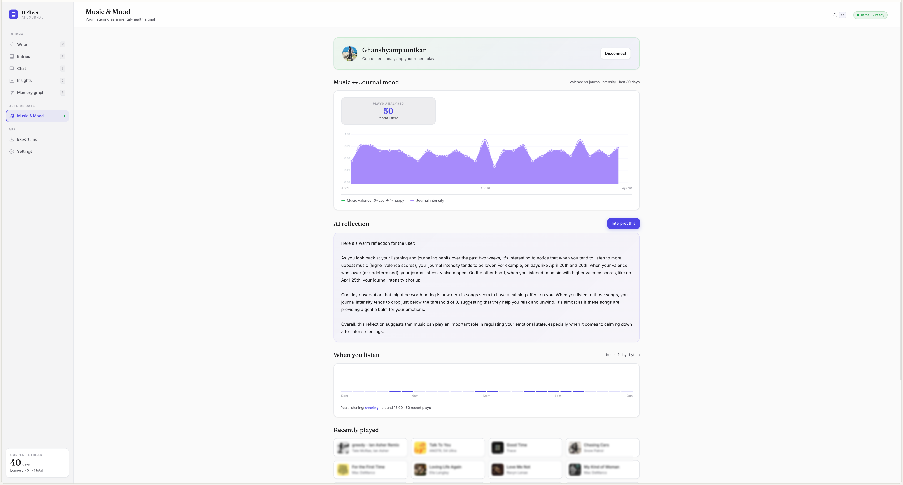

<div align="center">

# Innerbloom — Advanced AI Journal

### An AI journal that understands your patterns, emotions, and contradictions — running entirely on your machine.

Journaling is powerful when someone reads what you write—finds patterns, notices contradictions, and reflects them back to you. **Innerbloom** does that using local LLMs, semantic search, and real-time reasoning. Nothing leaves your machine.

[](https://www.python.org/)
[](https://fastapi.tiangelo.com/)
[](https://ollama.ai/)
[](LICENSE)

</div>

---

## What You Get

### 📝 Write — Distraction-free with instant AI analysis
Every entry gets analyzed for emotion, intensity (1–10), themes, and tags. The system learns your patterns in real-time.


### 💬 Chat with Your Journal — Multi-turn reasoning with live steps
- Ask complex questions: *"What triggers my anxiety?"*, *"How have I been contradicting myself?"*
- Choose a **personality** (calm therapist, honest coach, analytical observer) 
- Watch the AI think in real-time: see it planning → searching memory → drafting your answer
- Get **citations** to specific entries that back up every claim


### 🧠 Four Deep Insight Cards
- **Contradictions**: Where you say one thing but consistently do another (with evidence)
- **Emotional Triggers**: Patterns in what makes you anxious, frustrated, or happy
- **Wellbeing**: Burnout trends + emotional spirals with warning signs
- **Identity & Narrative**: Your core values, tensions, and how your arc is changing over time


### 🕸️ Memory Graph with named clusters
- See your entries as an interactive force-directed graph (mind map)
- **Clusters auto-named** — connected groups of entries are labelled after their dominant theme/tag (e.g. *"Self-Awareness"*, *"#sleep"*, *"Belonging"*)
- Each cluster gets its own colour + a soft hull behind it
- Clickable legend lets you **focus one cluster** (dims everything else)
- Drag, hover, zoom — click any node to open that entry


### 🔐 Crisis Detection
- Two-stage system: keyword-based initial screening + LLM semantic understanding
- If detected, shows immediate helpline access in a safety card
- Zero false positives while catching what matters

### 📊 Full Statistics & Streaks
- Heatmap (GitHub-style, 365 days at a glance)
- Current streak counter
- Emotion distribution across your entire journal
- Daily entry volume

### 🎵 Spotify Integration (optional)
- Connect your Spotify account (OAuth, zero secrets stored)
- **Genre-derived mood scatter** — each track placed on a valence × energy plane via a curated genre→mood table (works on every Spotify app, no `/audio-features` needed)
- Quadrant histogram + a one-sentence read of your current music mood
- Listening-pattern heatmap (hour × day-of-week)
- AI interpretation correlating your music with journal intensity



### 🌱 Month-ago surfacing
- Every time you open Write, Innerbloom looks at entries from around 30 days ago
- A then-vs-now card shows your dominant emotion, top tags, and avg intensity for both windows
- A short LLM-written reflection: **what's stayed the same · what's actually shifted · what you're still avoiding · the direction you're moving in** — every claim citing the entries it pulled from
- Click any citation pill to jump to that entry
- Dismiss for the day; re-fires once you write something new

### 🔔 Local notifications
- All scheduled in-browser, **nothing leaves your machine**
- Configurable in Settings:
  - **Morning prompt** — your daily LLM-generated journaling question at 8:30 am
  - **Evening reflection** — 9 pm nudge if you haven't written yet
  - **Streak risk** — 10:30 pm if your streak is > 3 days and today is empty
  - **Month-ago surfacing** — once per day if there's a real "then vs now" match
  - **Wellbeing alert** — when the burnout or spiral signal goes above "ok"
- Fires while the tab is open; install Innerbloom as a PWA for background delivery

---

## How It Works

### Semantic Memory (No Hallucinations)
- Entries are embedded using `nomic-embed-text` for semantic understanding
- When you ask a question, the system searches both keywords AND semantic meaning
- All claims cite specific entries with timestamps — no made-up references

### Agent Loop with Streaming Steps
The chat uses a real agent architecture:
1. **Planner** — LLM reads your question and decides which tools to use
2. **Tools** — Search journal, retrieve specific entries, list themes/patterns
3. **Drafter** — LLM synthesizes findings into a coherent answer
4. **Streaming** — You see each step in real-time, then tokens streaming in as the answer forms

### Personality Modes
Switch your AI's voice:
- **Honest Coach**: Direct, practical, calls out patterns
- **Calm Therapist**: Warm, validating, exploratory
- **Analytical Observer**: Data-focused, pattern-heavy, detached

Each mode uses a different system prompt and has its own reasoning style.

### Insight Engines
- **Contradictions**: LLM identifies stated values vs. actual behavior, requires evidence IDs
- **Triggers**: Statistical analysis + LLM characterization of emotional patterns
- **Wellbeing**: 14-day rolling burnout trend + 7-day emotional trajectory
- **Narrative**: Identity extraction, values, tensions, and character arc analysis

All insights are stored in `data/insights.json` for review history.

---

## Quickstart

### Prerequisites
- **Python 3.10+**
- **Ollama** installed and running: https://ollama.ai
- A pulled model (we use `llama3.2:3b` — ~2 GB, runs on 8 GB RAM)
- Optional: `nomic-embed-text` for semantic search (`ollama pull nomic-embed-text`)

### 1. Clone & Install

```bash
git clone https://github.com/yourusername/innerbloom.git
cd innerbloom

pip install -r requirements.txt
```

### 2. Start Ollama (if not already running)

```bash
ollama serve
# In another terminal:
ollama pull llama3.2:3b
ollama pull nomic-embed-text  # for semantic search
```

### 3. Run the Backend

```bash
uvicorn app:app --host 0.0.0.0 --port 5000
```

The server will start on `http://localhost:5000`. All your journal data lives in `./data/`.

### 4. Serve the Frontend

In another terminal:

```bash
cd innerbloom
python -m http.server 8000
# Open http://localhost:8000/index.html
```

That's it. You're ready to journal.

---

## Usage

### Writing an Entry
1. Click **Write** or press `W`
2. Type or paste your thoughts
3. Hit `Cmd/Ctrl-S` to save — the AI analyzes instantly
4. Tags and emotion are assigned automatically

### Chatting with Your Journal
1. Click **Chat** or press `C`
2. Toggle between **Journal** (uses your entries) and **General** (unrestricted conversation)
3. Pick a **Personality** (you can switch per message)
4. Type a question and watch the agent think in real-time
5. Click citation pills `[id=...]` to open the source entry

### Viewing Insights
1. Click **Insights** or press `I`
2. Scroll through four cards:
   - **Contradictions**: Stated vs. actual behavior
   - **Triggers**: What consistently affects your mood
   - **Wellbeing**: Burnout and spirals
   - **Identity**: Values, tensions, narrative arc
3. Each card includes cited entries you can click into

### Exploring Your Memory Graph (Mind Map)
1. Click **Graph** in the top nav
2. **Drag** nodes to rearrange
3. **Hover** to see entry details
4. **Scroll** to zoom in/out
5. Click a node to open that entry

### Search
- **Keyword search**: Find entries mentioning "work", "anxiety", etc.
- **Semantic search**: Search by meaning — "when did I feel unappreciated?" finds entries with similar emotional content

---

## Environment Variables

```bash
# Model
INNERBLOOM_MODEL=llama3.2:3b

# Embeddings for semantic search
INNERBLOOM_EMBED_MODEL=nomic-embed-text

# Ollama endpoints (defaults to localhost)
INNERBLOOM_OLLAMA_URL=http://localhost:11434/api/generate
INNERBLOOM_OLLAMA_EMBED_URL=http://localhost:11434/api/embeddings

# Data storage
INNERBLOOM_DATA_DIR=./data
```

### Picking a Model

The default is **`llama3.2:3b`** — it fits on 8 GB of RAM and runs at conversational speed. Innerbloom is built so swapping the model only changes *quality*; every endpoint, every insight engine, and every prompt works at any size. Here's what you actually gain by going bigger:

| Model                           | RAM needed     | Speed (M1)        | What gets better                                                                                              |
| ------------------------------- | -------------- | ----------------- | ------------------------------------------------------------------------------------------------------------- |
| `llama3.2:3b` *(default)*       | 8 GB           | ~30 tok/s         | Solid daily driver. Snappy chat, decent insights. Occasionally misses subtle contradictions.                  |
| `qwen2.5:7b-instruct`           | 8 GB tight     | ~15 tok/s         | Noticeably sharper at *narrative* and *contradictions*. Better at preserving long-context structure.          |
| `mistral:7b-instruct`           | 8 GB tight     | ~18 tok/s         | Drier voice, very good at *triggers* (stats-style reasoning). Worst pick for *calm therapist* personality.    |
| `llama3.1:8b`                   | 16 GB ideal    | ~10 tok/s         | The single biggest **insight quality** jump. Reflections feel personal instead of generic. Background-only on 8 GB. |
| `qwen2.5:14b`                   | 16+ GB         | ~4 tok/s          | Therapist-grade nuance. Insight engines start naming patterns a friend would name. Chat is slow.              |
| `gpt-oss:20b` / `mixtral:8x7b`  | 24+ GB / 48+ GB| 2–6 tok/s         | If you have the hardware, the *narrative* and *wellbeing summary* engines become genuinely worth re-reading.  |

Pull any model first:

```bash
ollama pull llama3.1:8b
INNERBLOOM_MODEL=llama3.1:8b uvicorn app:app --port 5000
```

### Embeddings matter more than chat size

On any machine, the biggest *single* upgrade is **pulling the embedding model**:

```bash
ollama pull nomic-embed-text
```

Without it, retrieval falls back to keyword matching. With it, you get real semantic search — "when did I feel unappreciated?" finds the entries about *being overlooked* even if neither word appears. This costs 274 MB and roughly doubles the felt intelligence of chat.

### What changes when you upgrade

The pieces that *most* benefit from a bigger model, ranked:

1. **Contradiction engine** — needs careful reading; 3B finds ~half what 8B finds
2. **Narrative engine** — coherent self-arcs need long-range attention; 3B writes flatter identity lines
3. **Month-ago reflection** — same/shifted/avoiding card; 3B sometimes misses what shifted
4. **Wellbeing summary** — quality of the 1-2 sentence read, not the level itself (levels are stats-driven)
5. **Adaptive prompt** — bigger models pick prompts that connect to *your* themes, not generic ones

The pieces that **don't really care** about model size: streaks, heatmap, tag cloud, memory graph clusters, Spotify genre mapping, crisis keyword detection. All deterministic.

---

## API Reference

### Core

| Method | Path | Purpose |
|---|---|---|
| `POST` | `/save` | Create & analyze entry |
| `GET` | `/journal` | List all entries (filters: `q`, `tag`, `emotion`) |
| `GET` | `/journal/{id}` | Retrieve single entry |
| `PUT` | `/journal/{id}` | Edit entry |
| `DELETE` | `/journal/{id}` | Delete entry |

### Chat & Agent

| Method | Path | Purpose |
|---|---|---|
| `POST` | `/chat` | One-shot chat with citations |
| `POST` | `/chat/agent` | Agent loop with JSONL streaming (plan→tools→draft) |
| `POST` | `/chat/stream` | Token-streamed chat reply |
| `GET` | `/chat` | Chat history |
| `DELETE` | `/chat` | Clear history |

### Insights & Analysis

| Method | Path | Purpose |
|---|---|---|
| `GET` | `/analyze` | Long-term synthesis (emotions, contradictions, themes) |
| `GET` | `/stats` | Streaks, word counts, emotion distribution, heatmap |
| `GET` | `/graph` | Memory graph nodes, edges, and named clusters (force-directed layout) |
| `GET` | `/anniversary?days=30` | Then-vs-now comparison around N days ago with LLM reflection |
| `GET` | `/weekly-review` | Last 7 days reflection |
| `GET` | `/monthly-review` | Last 30 days reflection |
| `GET` | `/search?q=` | Keyword + semantic search |
| `GET` | `/prompt` | Adaptive journaling prompt based on recent mood |

### Health & Status

| Method | Path | Purpose |
|---|---|---|
| `GET` | `/` | App status |
| `GET` | `/health` | Ollama connection status |

---

## Testing

Run the full test suite:

```bash
pip install httpx
python test_app.py
```

Expected: **69 tests passing**

Tests cover:
- Entry CRUD
- Chat with citations
- Agent loop
- Insight engines
- Search (keyword + semantic)
- Crisis detection
- Stats & analytics

---

## Architecture

```
┌─────────────────────────┐         ┌──────────────────────┐
│   index.html (SPA)      │◄───────►│   app.py (FastAPI)   │
│   - Write / Chat        │  HTTP   │   - Routes + RAG     │
│   - Insights / Graph    │         │   - Semantic search  │
│   - Personality toggle  │         │   - Insight engines  │
└─────────────────────────┘         └──────────┬───────────┘
          │                                    │
          │                                    ▼
          │                        ┌──────────────────────┐
          │                        │  Ollama (localhost)  │
          │                        │  llama3.2:3b         │
          │                        │  nomic-embed-text    │
          │                        └──────────────────────┘
          │
          │ (optional)
          │ OAuth
          ▼
    ┌──────────────┐
    │   Spotify    │
    └──────────────┘
```

**Key Design Decisions:**
- **No embeddings in chat by default** — fast keyword search works well for small journals
- **Lazy embedding backfill** — embeddings computed on first use, cached thereafter
- **JSONL streaming** — Agent steps and tokens arrive in real-time as they complete
- **Citations as JSON** — Manifest includes full entry data so citations build instantly
- **Single-file frontend** — No build step, no dependencies, no node_modules

---

## Privacy & Security

✅ **100% private by default**
- No cloud, no account, no telemetry
- Entries live in `./data/` on your machine only
- Innerbloom never calls home

✅ **Internet requests:**
- `localhost:11434` (Ollama, local)
- Spotify API (only if you connect it, and only on your behalf via OAuth)
- Nothing else

✅ **To erase everything:**
```bash
rm -rf data/
```

---

## Keyboard Shortcuts

| Key | Action |
|---|---|
| `W` | Jump to Write |
| `C` | Jump to Chat |
| `I` | Jump to Insights |
| `G` | Jump to Memory Graph |
| `Cmd/Ctrl-S` | Save entry |
| `Esc` | Close modals |

---

## Spotify Setup (Optional)

1. Go to [developer.spotify.com/dashboard](https://developer.spotify.com/dashboard)
2. Create an app and copy the **Client ID**
3. In Innerbloom's **Settings**, paste the Client ID and note the redirect URI shown
4. Add that redirect URI to your Spotify app's settings (must match exactly)
5. Click **Connect Spotify** and follow the OAuth flow

Innerbloom uses PKCE (no client secrets), so your Spotify token is stored locally and auto-refreshes.

---

## Contributing

Found a bug? Have a feature idea? Open an issue or PR. All contributions welcome.

---

## License

**MIT** — Build, modify, and use Innerbloom however you want. No restrictions.

---

<div align="center">

*Innerbloom is built on the idea that the best person to understand your mind is you—with a little help from local AI.*

**Made with 🤖 + ❤️ for clearer thinking.**

</div>
